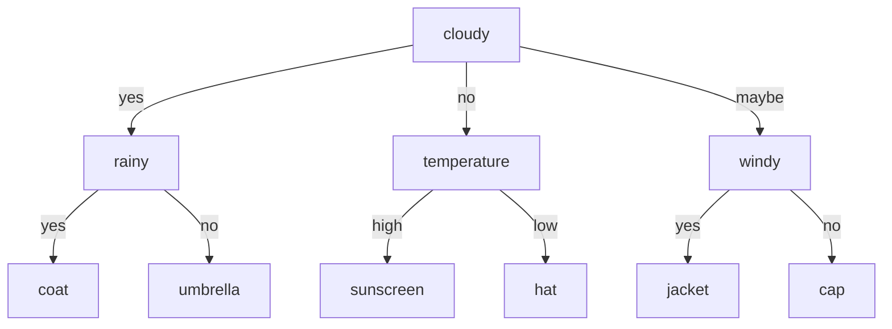

Thought I'll might just tackle some of the most interesting data science concepts related to questions that one can throw at you during a data science interview. I'll keep doing that for as long as possible.

"What is a **decision tree** and how do you build one?"

In many cases decision trees are overlooked but in fact they are the basis of many very modern and powerful algorithms. "Decision tree learning" is a prime example of "inductive inference" which I will talk about in a future post. 

Roughly a decision tree at each node specifies a test for attributes of the data input. Evaluating the tests from root to bottom one can reach the proposed decision. It has some very strong points, among them , a very sought after property, can be transformed to if-then-else code and are practically an amazing way to present to a not-so mathie audience.

They can very easily be learned, and the basic process more or less follows a few basic steps :

1. At the root select the attribute that best splits the data, e.g. attribute "cloudy" for a day vector. 
2. Add branches with all the possible values of the discrete attribute
3. Place data to each of the branches 
4. For each of the branches data start from 1 and repeat

What this algorithm does is it works by finding the attribute that best splits the data and then continues iteratively by working on the data attributes of each subset until some criterion is met. The most common algorithm is called ID3.

